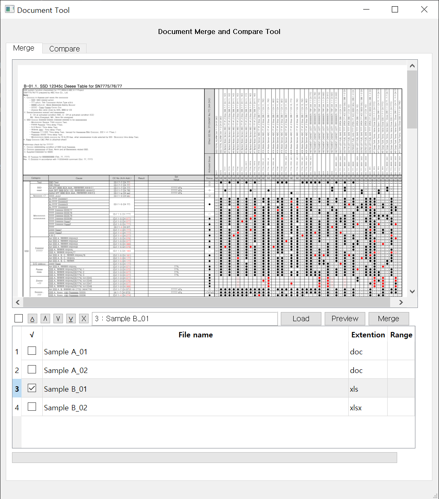
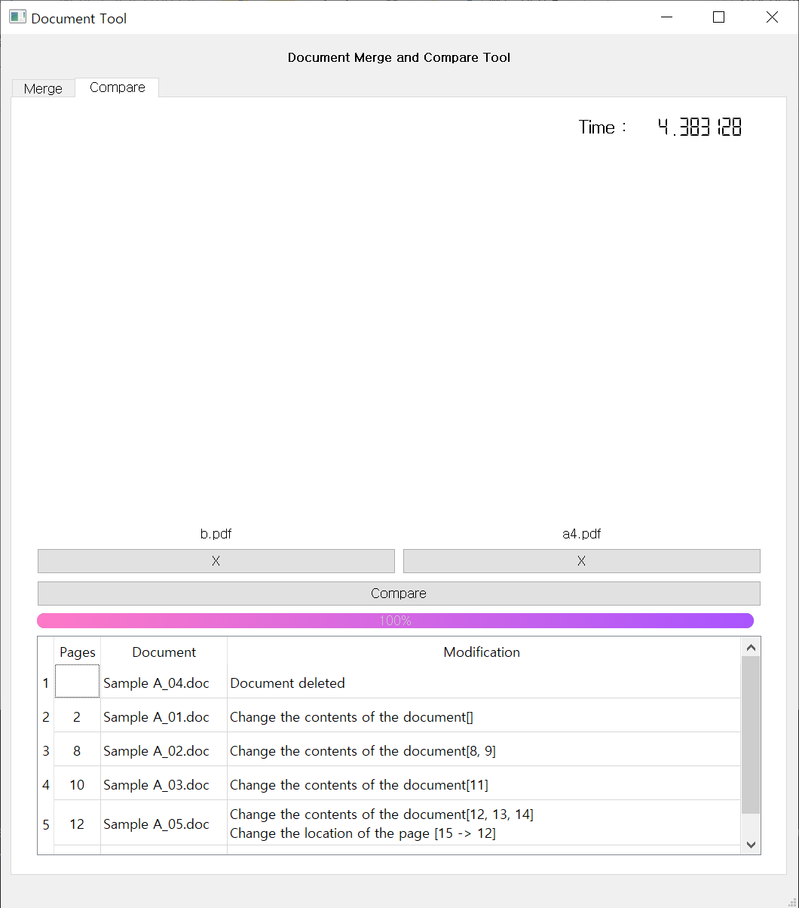

# Document Merge & Diff Tool

> ⚠️ **Notice**: 본 프로젝트는 **삼성중공업(Samsung Heavy Industries)**과의 산학 협력 과제 결과물입니다. 
> 관련 기술 이전 및 보안 규정에 따라 **전체 소스 코드는 외부에 공개할 수 없음**을 양해 부탁드립니다.

**Document Merge & Diff Tool**은 PDF, Word, Excel 등 다양한 형식의 문서를 하나로 병합하고, 두 문서 간의 변경 사항을 비교하여 차이점을 직관적으로 확인할 수 있게 해주는 데스크톱 애플리케이션입니다. 사용자는 편리한 GUI 환경을 통해 문서 병합 순서를 지정하거나 특정 페이지를 추출할 수 있으며, 표지 및 목차 자동 생성 기능을 통해 문서화 작업을 크게 단축할 수 있습니다.

  
  

## 🚀 주요 기능 (Features)

- **다양한 문서 형식 지원 및 병합**: 
    - Word(doc, docx), Excel(xls, xlsx), PDF 포맷의 문서를 하나의 PDF 파일로 변환 및 병합
    - Word(doc, docx) 포맷의 문서를 하나의 docx 파일로 병합
    - Excel(xls, xlsx) 포맷의 문서를 하나의 xlsx 파일 내에서 하나의 워크시트 또는 여러 개의 워크시트로 병합
- **문서 비교(Diff) 기능**: 두 개의 문서를 비교하여 변경된 내용을 분석하고 페이지 단위 변경 이력을 추출
- **페이지 추출 및 선택 병합**: 병합할 문서의 전체 페이지뿐만 아니라 사용자가 원하는 특정 페이지나 워크시트(Excel)만 선택하여 유연하게 병합 가능
- **표지 및 목차 자동 생성**: 사용자 입력 정보를 바탕으로 병합된 문서의 표지(Cover Page)와 목차(Index Page)를 자동으로 생성
- **페이지 번호 및 책갈피 추가**: 병합이 완료된 PDF 문서에 자동으로 전체 페이지 번호를 기입하고, 문서 구조에 맞는 책갈피(Bookmark) 및 메타데이터를 생성하여 탐색 편의성 제공
- **직관적인 사용자 인터페이스(UI)**: 드래그 앤 드롭(Drag & Drop)을 통한 간편한 파일 추가, 병합 전 미리보기(Preview) 기능, 문서 병합 순서 변경(Top/Up/Down/Bottom)을 지원하는 사용성이 뛰어난 Qt5 기반 GUI 제공

## 🛠 기술 스택 (Tech Stack)

- **언어**: Python 3
- **라이브러리**: PyQt5, pywin32 (win32com)