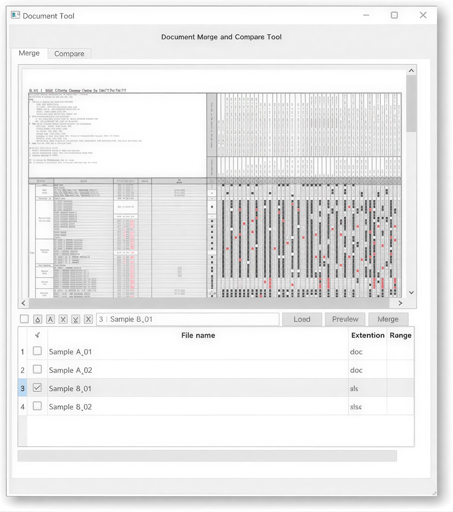
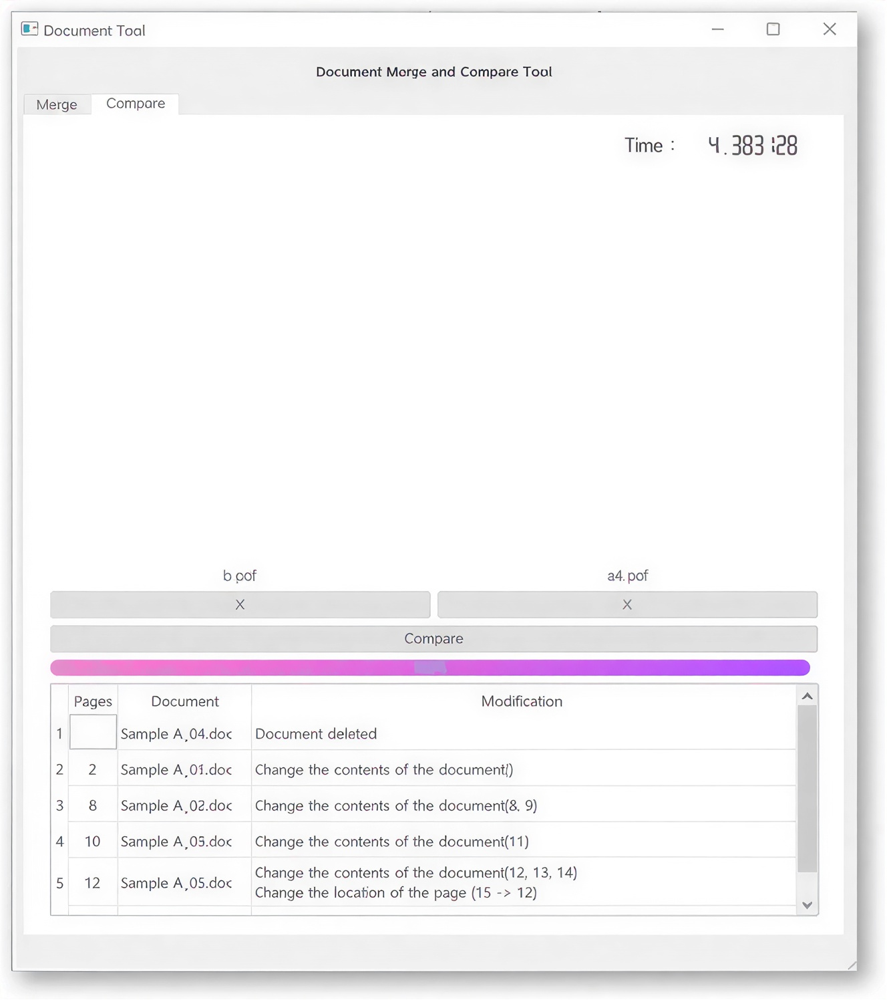

# Document Merge & Diff Tool

> ⚠️ **Notice**: This project is the result of an industry-academic collaboration with **Samsung Heavy Industries**. 
> Please understand that **the full source code cannot be disclosed externally** due to related technology transfer and security regulations.

**Document Merge & Diff Tool** is a desktop application that merges various formats of documents such as PDF, Word, and Excel into one, and compares the changes between two documents to intuitively check the differences. Users can easily specify the document merge order or extract specific pages through a convenient GUI environment, and significantly reduce documentation work through the automatic generation of cover and index pages.

  
  

## 🚀 Features

- **Support & Merge Various Document Formats**: 
    - Convert and merge documents in Word (doc, docx), Excel (xls, xlsx), and PDF formats into a single PDF file
    - Merge documents in Word (doc, docx) format into a single docx file
    - Merge documents in Excel (xls, xlsx) format into a single worksheet or multiple worksheets within a single xlsx file
- **Document Comparison (Diff) Function**: Analyzes modified contents by comparing two documents and extracts page-level revision history
- **Page Extraction & Selective Merging**: Flexibly merge by selecting only specific pages or worksheets (Excel) desired by the user, as well as the entire pages of the documents to be merged
- **Automatic Generation of Cover & Index Pages**: Automatically generates the cover page and index page of the merged document based on user input information
- **Add Page Numbers & Bookmarks**: Automatically inputs total page numbers into the merged PDF document, and generates bookmarks and metadata suitable for the document structure to provide navigation convenience
- **Intuitive User Interface (UI)**: Provides a highly usable Qt5-based GUI that supports easy file addition through Drag & Drop, Preview function before merging, and document merge order change (Top/Up/Down/Bottom)

## 🛠 Tech Stack

- **Language**: Python 3
- **Libraries**: PyQt5, pywin32 (win32com)
